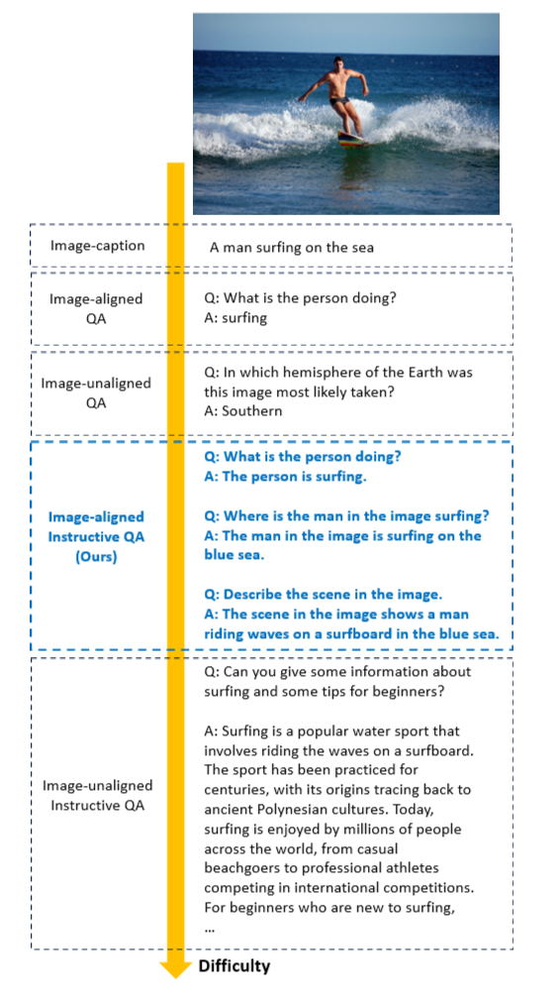
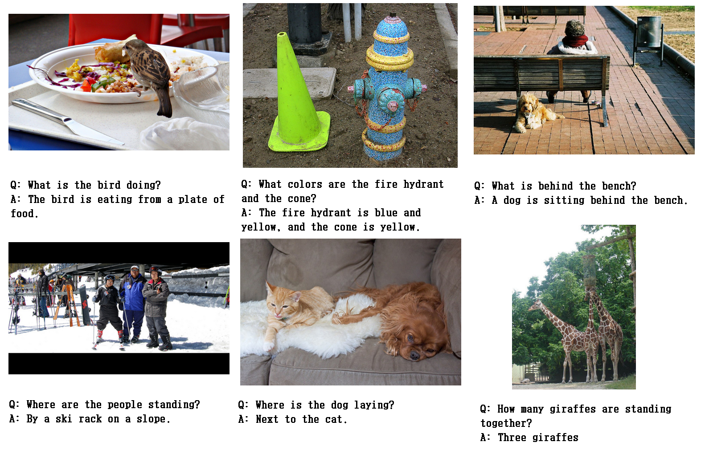

# Visually Dehallucinative Instruction Generation

**Visually Dehallucinative Instruction Generation** [[paper](https://link/to/paper)] <br>
[Sungguk Cha](https://sunggukcha.github.io), Jusung Lee, Younghyun Lee and Cheoljong Yang
## CAP2QA
### Image-aligned Sentence Level VQA Data
 <br>

### Details
| Dataset             | Avg. \#word Question/Answer | \#Image | \#Question | Scalable | ImageAligned | Recognition | Description | Reasoning |
|---------------------|-----------------------------|---------|------------|----------|--------------|-------------|--------------------------|-----------------------|
| DAQUAR              | 11.5/1.1 (word)             | 1,449   | 12,468     | $\times$ | $\checkmark$ | $\checkmark$| $\times$                 | $\times$              |
| VQAv2               | 6.1/1.2 (word)              | 200k    | 1.1M       | $\times$ | $\checkmark$ | $\checkmark$| $\times$                 | $\times$              |
| OKVQA               | 8.1/1.3 (word)              | 14,031  | 14,055     | $\times$ | $\times$     | $\checkmark$| $\times$                 | $\checkmark$          |
| LLaVA               | 10.7/60.7 (sentence)        | 80,000  | 221,333    | $\checkmark$| $\times$   | $\checkmark$| $\checkmark$            | $\checkmark$          |
| **CAP2QA** (Ours)   | 7.2/5.4 (sentence)          | 122,906 | 873,631    | $\checkmark$| $\checkmark$ | $\checkmark$| $\checkmark$          | $\checkmark$          |

Prepare MSCOCO 2017 images. 
Train/Val splits are preserved.

## Citation
If you find CAP2QA useful for your research and applications, please cite using this BibTeX:
```
@inproceedings{cha2024visually,
      title={Visually Dehallucinative Instruction Generation}, 
      author={Cha, Sungguk and Lee, Jusung and Lee, Younghyun and Yang, Cheoljong},
      booktitle={IEEE International Conference on Acoustics, Speech and Signal Processing (ICASSP)},
      year={2024},
}
```

## Licenses
This work, [instructions](/instructions), used COCO-Caption dataset (CC BY-NC-ND license) for the caption source and ChatGPT (refer OpenAI policies, https://openai.com/policies).

